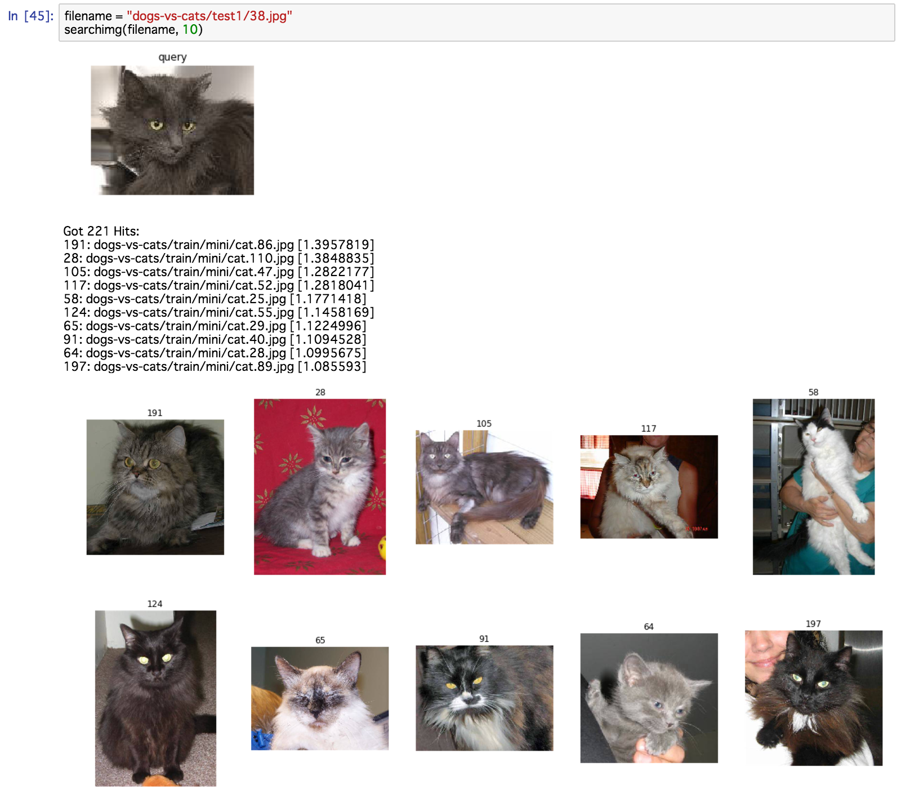
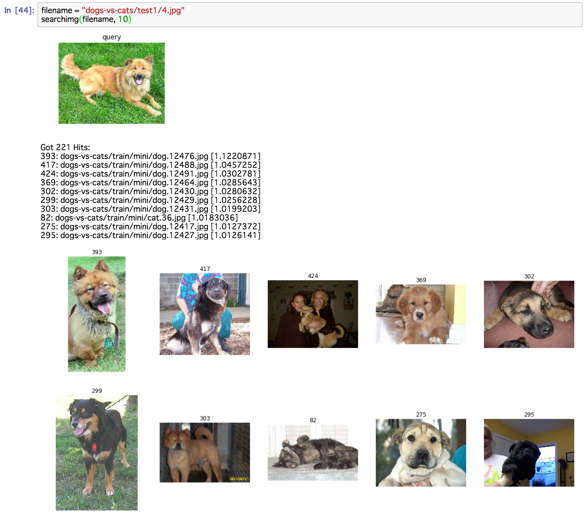

# Super Easy Way of Building Image Search with Keras

Introduction of Deep Learning for Information Retrieval Researchers in __LIARR 2017__. (11, Aug. 2017)

## 1. ABSTRACT

This paper provides detailed suggestions to create an Image Search Engine with Deep Learning.  ere are still few a empts with Deep Learning on a search engine. Here is a good idea of an extremely easy way of building an image search with Elasticsearch and Keras on Jupyter Notebook. So, it is demonstrated how an image search engine can be created where Keras is used to extract features from images, and Elasticsearch is used for indexing and retrieval. 

To demonstrate how easily this can be achieved, Jupyter Notebook is used with two open source libraries, Keras and Elasticsearch.  en, the image search engine can search relevant images by images or keywords. In our approach, keras is regarded as analysis which is a process of converting an image into tokens or terms which are added to the inverted index for searching.

## 2. INSTALLATION

We have to install some libraries: Python, Elasticsearch, Keras, Jupyter Notebook, and TensorFlow. Jupyter Notebook and TensorFlow are optional, because Jupyter Notebook is used for my demonstration and Theano or CNTK is available for Kearas instead of TensorFlow.

My demo environment is MacBook Pro (Retina, 15-inch, Mid 2015). OS X El Capitan (version 10.11), Python 2.7.13 <Anaconda 4.3.1 (x86_64)>, Elasticsearch 5.4.1, Keras 2.0.4, Jupyter Notebook 4.2.1, and TensorFlow 1.1.0 are installed. I guess Python 3+ is OK and Elasticsearch 2+ is also OK. Of course, Linux and Windows are both OK.

### 2.1 Python

Python is a programming language that lets you work quickly and integrate systems more effectively. 
You can download the latest version Python 3.6.2 or Python 2.7.13. Also, Python source code and installers are available for download for all versions.

https://www.python.org/

If you want to check the version, just type 'python -V'.

    $ python -V
    Python 2.7.13 :: Anaconda 4.3.1 (x86_64)

### 2.2 Elasticsearch

Elasticsearch is an open source search engine based on Lucene.
Download package for your platform. Extract .zip or tar.gz file cd into extracted folder.

https://www.elastic.co/

If you want to check the version, just type 'curl --silent -XGET http://localhost:9200 2>&1 | grep "number"', after Elasticsearch has been launched.

    $ curl --silent -XGET http://localhost:9200 2>&1 | grep "number"
        "number" : "5.4.1",

### 2.3 Keras

Keras is the Python deep learning library. Keras is compatible with: Python 2.7-3.5 now.
Instalation is written in the following URL.

https://keras.io/

If you want to check the version, just type 'python -c "import keras; print keras.__version__"'.

    $ python -c "import keras; print keras.__version__"
    Using TensorFlow backend.
    2.0.4

### 2.4 Jupyter Notebook

The Jupyter Notebook is an open-source web application that allows you to create and share documents that contain live code, equations, visualizations and explanatory text.
Python is a requirement (Python 3.3 or greater, or Python 2.7) for installing the Jupyter Notebook.
Anaconda distribution is recommended for using to install Python and Jupyter.

http://jupyter.org/install.html

If you want to check the version, just type 'jupyter --version'.

    $ jupyter --version
    4.2.1

### 2.5 TensorFlow

TensorFlow is an open-source software library for Machine Intelligence, which can be used for backend of Keras.
The following URL explains how to install a version of TensorFlow that enables you to write applications in Python.

https://www.tensorflow.org/install/

If you want to check the version, just type 'python -c "import tensorflow as tf; print(tf.__version__)"'.

    $ python -c "import tensorflow as tf; print(tf.__version__)"
    1.1.0

## 3. DEMONSTRATION

First of all, Kaggle dogs-vs-cats dataset should be downloaded on your machine.
The indexing function is composed of Keras and Elasticsearch, which indexes dog and cat images as a search target. Keras plays a role of feature extraction.  Then, Elasticsearch has an index for image file retrieval.

### 3.1 Download Images

It's a competition to classify whether images contain either a dog or a cat. This is easy for humans, dogs, and cats, but computers will find it a bit more difficult.
The training archive contains 25,000 images of dogs and cats. Train your algorithm on these files and predict the labels for test1.zip.

https://www.kaggle.com/c/dogs-vs-cats/data

You can download test1.zip and train.zip.

### 3.2 Load Libraries for Keras

````python
# Load libraries
from keras.applications.vgg16 import VGG16, preprocess_input, decode_predictions
from keras.preprocessing import image
from PIL import Image
import matplotlib.pyplot as plt
import numpy as np
import sys

model = VGG16(weights='imagenet')
````

### 3.3 Function Declaration for Keras

````python
# Predict Function
def predict(filename, featuresize):
    img = image.load_img(filename, target_size=(224, 224))
    x = image.img_to_array(img)
    x = np.expand_dims(x, axis=0)
    preds = model.predict(preprocess_input(x))
    results = decode_predictions(preds, top=featuresize)[0]
    return results
````

### 3.4 Predict Test

````python
# Predict an image
filename = "dogs-vs-cats/train/mini/cat.6.jpg"
plt.figure(figsize=(20, 10))
for i in range(1):
    showimg(filename, "query", i+1)
plt.show()
results = predict(filename, 10)
for result in results:
    print(result)
````

<p align="left">
  
</p>

### 3.5 Load Libraries for Elasticsearch

````python
import os
from path import Path
from elasticsearch import Elasticsearch

es = Elasticsearch(host='localhost', port=9200)
````

### 3.6 Function Declaration for Index

````python
def createindex(indexname):
    if es.indices.exists(index=indexname):
        es.indices.delete(index=indexname)
    es.indices.create(index=indexname,  body={
        "index.mapping.total_fields.limit": 10000
    })

def loadimages(directory):
    imagefiles = []
    for file in os.listdir(directory):
        filepath = os.path.join(directory, file)
        imagefiles.append(filepath)
    return imagefiles

def indexfiles(directory, featuresize=10):
    imagefiles = loadimages(directory)
    for i in range(len(imagefiles)):
        filename = imagefiles[i]
        indexfile(filename, i, featuresize)
    es.indices.refresh(index="image-search")    

def indexfile(filename, i, featuresize):
    doc = {'filename': filename, 'synset':{}}
    results = predict(filename, featuresize) 
    for result in results:
        synset = doc['synset']
        synset[result[1]] = {
            'wnid': result[0], 
            'words': result[1], 
            'score': float(str(result[2]))
        }
    count = es.count(index='image-search', doc_type='image')['count']
    res = es.index(index="image-search", doc_type='image', id=(count + i), body=doc)
````

### 3.7 Index Images

````python
createindex("image-search")

directory = "dogs-vs-cats/train/"
indexfiles(directory, 1000)
````

If you want to recreate the index, you need to delete the index.

````python
es.indices.delete(index='image-search')
````

    {u'acknowledged': True}

### 3.8 Function Declaration for Search

````python
from PIL import Image
import matplotlib.pyplot as plt
import numpy as np

def showimg(filename, title, i):
    im = Image.open(filename)
    im_list = np.asarray(im)
    plt.subplot(2, 5, i)
    plt.title(title)
    plt.axis("off")
    plt.imshow(im_list)

def searchimg(filename, num):
    plt.figure(figsize=(20, 10))
    for i in range(1):
        showimg(filename, "query", i+1)
    plt.show()
    results = predict(filename, num)
    search(results, num)

def search(synsets, num):
    inline = "1.000";
    for synset in synsets:
        words = synset[1]
        score = synset[2]
        inline += " + doc['synset." + words + ".score'].value * " + str(score)
    res = es.search(index="image-search", doc_type='image', body={
        "query": {
            "function_score": {
                "query": {"match_all": {}},
                "script_score" : {"script" : {"inline": inline}}
        }}})
    
    print("Got %d Hits:" % res['hits']['total'])
    for hit in res['hits']['hits'][0:num]:
        print "%s: %s [%s]" % (hit["_id"], hit["_source"]["filename"], hit["_score"])
    plt.figure(figsize=(20, 10))
    
    for i in range(len(res['hits']['hits'][0:num])):
        hit = res['hits']['hits'][0:num][i]
        showimg(hit["_source"]["filename"], hit["_id"], i+1)
    plt.show()
````

### 3.9 Search Test

````python
filename = "dogs-vs-cats/test1/4.jpg"
searchimg(filename, 10)
````

<p align="left">
  
</p>

````python
filename = "dogs-vs-cats/test1/38.jpg"
searchimg(filename, 10)
````

<p align="left">
  
</p>

````python
filename = "dogs-vs-cats/train/mini/cat.7.jpg"
searchimg(filename, 10)
````

<p align="left">
  
</p>

````python
filename = "dogs-vs-cats/train/mini/dog.12466.jpg"
searchimg(filename, 10)
````

<p align="left">
  
</p>

